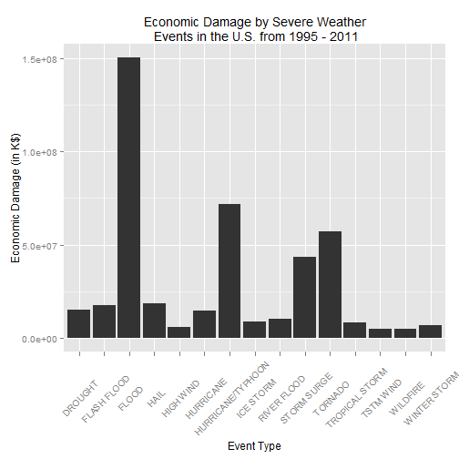

## Weather Events causing Public Health and Economic Problems

#### Data source: U.S. National Oceanic and Atmospheric Administration's (NOAA) storm database [Storm data](https://d396qusza40orc.cloudfront.net/repdata%2Fdata%2FStormData.csv.bz2)
There is also some documentation of the database available. Here you will find how some of the variables are constructed/defined.

1. National Weather Service Storm [Data Documentation](https://d396qusza40orc.cloudfront.net/repdata%2Fpeer2_doc%2Fpd01016005curr.pdf)

2. National Climatic Data Center Storm Events [FAQ](https://d396qusza40orc.cloudfront.net/repdata%2Fpeer2_doc%2FNCDC%20Storm%20Events-FAQ%20Page.pdf)

### Synopsis
Storms and other severe weather events can cause both public health and economic problems for communities and municipalities. Many severe events can result in fatalities, injuries, and property damage, and preventing such outcomes to the extent possible is a key concern.

This project involves exploring the U.S. National Oceanic and Atmospheric Administration's (NOAA) storm database. This database tracks characteristics of major storms and weather events in the United States, including when and where they occur, as well as estimates of any fatalities, injuries, and property damage.

This project address following questions:

1. Across the United States, which types of events (as indicated in the EVTYPE variable) are most harmful with respect to population health?

2. Across the United States, which types of events have the greatest economic consequences?

### Data Processing
#### Settings


```r
echo = TRUE  # Always make code visible
options(scipen = 1)  # Turn off scientific notations for numbers
Sys.setenv(LANG="EN") # Set language to English
library(R.utils)
library(ggplot2)
library(plyr)
require(gridExtra)
setwd("C:/Users/jchen.RESPONSYS/Documents/GitHub/RepData_PeerAssessment2")
```

#### Download and load data

```r
if (!"repdata-data-StormData.csv.bz2" %in% dir("./")) {
    print("Downloading data file")
    download.file("http://d396qusza40orc.cloudfront.net/repdata%2Fdata%2FStormData.csv.bz2", destfile = "repdata-data-StormData.csv.bz2")
}

storm_0 <- read.csv(bzfile("repdata-data-StormData.csv.bz2"))
```

#### What event type cause most fatalities and injuries?
1. Add up counts of FATALITIES and INJURIES by event types
2. Sort the count of events in decendent order
3. List the first 15 of them


```r
harm_by_etype <- aggregate( (FATALITIES + INJURIES) ~ EVTYPE, storm_0, sum)
names(harm_by_etype)[2] = "HarmfulEvent"
rank_by_etype_h <- arrange(harm_by_etype,harm_by_etype$HarmfulEvent,decreasing=T)
```
#### what event type cause the greatest economic consequences?
1. Since the unit of PROPDMG and CROPDMG varies from record to record, first rewrite them to thousand dollars unit
2. Sum up propertities damages and crop damages
3. Sort the sum of damages in decendent order
4. List the first 15 of them


```r
storm_0$prop <- 0
storm_0$crop <- 0

storm_0[which(storm_0$PROPDMGEXP %in% (1:9)),]$prop <- 
  storm_0[which(storm_0$PROPDMGEXP %in% (1:9)),]$PROPDMG / 100;
storm_0[which(toupper(storm_0$PROPDMGEXP) == "H"),]$prop <- 
    storm_0[which(toupper(storm_0$PROPDMGEXP) == "H"),]$PROPDMG / 10;
storm_0[which(toupper(storm_0$PROPDMGEXP) == "K"),]$prop <- 
    storm_0[which(toupper(storm_0$PROPDMGEXP) == "K"),]$PROPDMG;
storm_0[which(toupper(storm_0$PROPDMGEXP) == "M"),]$prop <- 
    storm_0[which(toupper(storm_0$PROPDMGEXP) == "M"),]$PROPDMG * 1000;
storm_0[which(toupper(storm_0$PROPDMGEXP) == "B"),]$prop <- 
    storm_0[which(toupper(storm_0$PROPDMGEXP) == "B"),]$PROPDMG * 1000000;
    
storm_0[which(storm_0$CROPDMGEXP %in% (1:9)),]$crop <- 
    storm_0[which(storm_0$CROPDMGEXP %in% (1:9)),]$CROPDMG / 100;
storm_0[which(toupper(storm_0$CROPDMGEXP) == "H"),]$crop <- 
    storm_0[which(toupper(storm_0$CROPDMGEXP) == "H"),]$CROPDMG / 10;
storm_0[which(toupper(storm_0$CROPDMGEXP) == "K"),]$crop <- 
    storm_0[which(toupper(storm_0$CROPDMGEXP) == "K"),]$CROPDMG;
storm_0[which(toupper(storm_0$CROPDMGEXP) == "M"),]$crop <- 
    storm_0[which(toupper(storm_0$CROPDMGEXP) == "M"),]$CROPDMG * 1000;
storm_0[which(toupper(storm_0$CROPDMGEXP) == "B"),]$crop <- 
    storm_0[which(toupper(storm_0$CROPDMGEXP) == "B"),]$CROPDMG * 1000000;

damage_by_etype <- aggregate( (prop + crop) ~ EVTYPE, storm_0, sum)
names(damage_by_etype)[2] = "EcoDmg"
rank_by_etype_d <- arrange(damage_by_etype,damage_by_etype$EcoDmg,decreasing=T)
```

### Results
#### The most harmful event types to population health:

```r
top15_h <- head(rank_by_etype_h,15)
hplot<-qplot(EVTYPE,data=top15_h,weight=HarmfulEvent,geom="bar",binwidth = 1)
hplot<-hplot+ggtitle("Harmful Events by Severe Weather\n Events in the U.S. from 1995 - 2011")
hplot<-hplot+labs(x="Event Type",y="Harmful Event Count")
hplot<-hplot+theme(axis.text.x=element_text(angle=45, size=10, vjust=0.5))
hplot
```

 

```r
names(top15_h)[1] <-"Event Type"
names(top15_h)[2] <-"Harmful Event Count"
top15_h
```

```
##           Event Type Harmful Event Count
## 1            TORNADO               96979
## 2     EXCESSIVE HEAT                8428
## 3          TSTM WIND                7461
## 4              FLOOD                7259
## 5          LIGHTNING                6046
## 6               HEAT                3037
## 7        FLASH FLOOD                2755
## 8          ICE STORM                2064
## 9  THUNDERSTORM WIND                1621
## 10      WINTER STORM                1527
## 11         HIGH WIND                1385
## 12              HAIL                1376
## 13 HURRICANE/TYPHOON                1339
## 14        HEAVY SNOW                1148
## 15          WILDFIRE                 986
```

#### The event types with the greatest economic consequences:

```r
top15_d <- head(rank_by_etype_d,15)
dplot<-qplot(EVTYPE,data=top15_d,weight=EcoDmg,geom="bar",binwidth = 1)
dplot<-dplot+ggtitle("Economic Damage by Severe Weather\n Events in the U.S. from 1995 - 2011")
dplot<-dplot+labs(x="Event Type",y="Economic Damage (in K$)")
dplot<-dplot+theme(axis.text.x=element_text(angle=45, size=10, vjust=0.5))
dplot
```

 

```r
names(top15_d)[1] <-"Event Type"
names(top15_d)[2] <-"Economic Damage (K$)"
top15_d
```

```
##           Event Type Economic Damage (K$)
## 1              FLOOD            150319678
## 2  HURRICANE/TYPHOON             71913713
## 3            TORNADO             57352115
## 4        STORM SURGE             43323541
## 5               HAIL             18758222
## 6        FLASH FLOOD             17562129
## 7            DROUGHT             15018672
## 8          HURRICANE             14610229
## 9        RIVER FLOOD             10148405
## 10         ICE STORM              8967041
## 11    TROPICAL STORM              8382237
## 12      WINTER STORM              6715441
## 13         HIGH WIND              5908618
## 14          WILDFIRE              5060587
## 15         TSTM WIND              5038936
```
### Conclusion  
From these data, we found that **tornado** is the most harmful event type to population health, and **flood** cause the greatest economic consequences.
